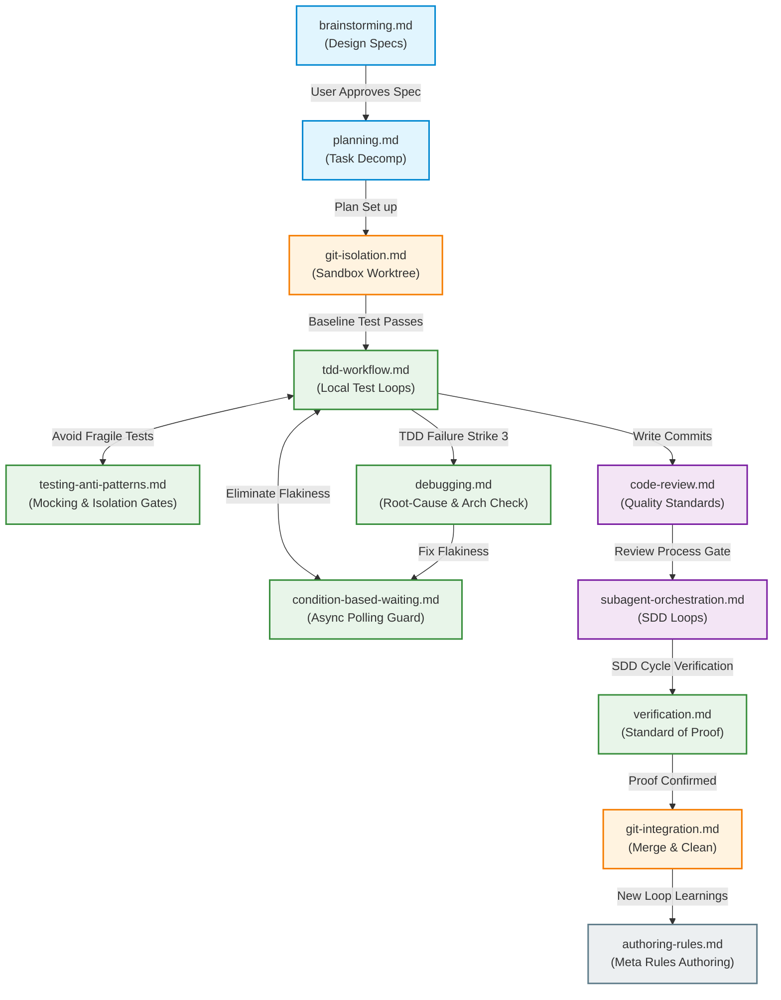

# AI Workspace Nexus (ai-workspace-nexus)

欢迎来到您的个人 AI 协同工作区与工作流配置枢纽。这是一个**专为主力 AI 编程助手 Antigravity 2.0 深度定制的原生配置插件包**。它集成了个人的开发技能（Skills）、自定义智能体（Subagents）、生命周期钩子（Hooks）以及外部协议配置（MCP Servers），旨在全方位沉淀您的软件工程规范、多媒体管理以及人机协作资产。

---

## 🎯 最终目标 (Ultimate Goal)

打造一个**“个人专属的 AI 辅助工作流引擎”**。当您与 Antigravity 2.0 协同工作时，该枢纽能够将您的**专业审美、工程/创作纪律、通用常识与工作流**无缝作为插件注入其运行上下文中，让其产出符合您个人高标准的工业级或专业级交付物。

---

## 🔒 移植性原则 (Portability Principles)

本仓库中的所有规范、模板、智能体提示词和钩子脚本，均严格遵循以下两项**不可违反**的移植性约束：

1. **零第三方库名污染**：所有文件内容中不得包含任何特定第三方工具库的专有命名空间或目录名称（例如 `superpowers/` 等）。规范中引用的目录和路径必须使用通用的、自定义的命名（如 `.planning/`、`skills/`）。
2. **零绝对路径依赖**：所有文件链接、路径引用和脚本均使用**同级/父级相对路径**或 Shell 环境变量（如 `${HOME}`、`$GEMINI_PROJECT_DIR`）进行符号化跳转，不允许硬编码任何用户级绝对路径（如 `C:\Users\...` 或 `/home/...`），确保在不同操作系统 and 用户环境下具备 **100% 的即插即用移植性**。

---

## 🏛️ 三层架构体系 (Three-Layer Architecture)

本项目遵循**“底层学习吸收 -> 中层沉淀通用 -> 顶层项目特化”**的结构：

```
+--------------------------------------------------------------+
| 🏆 顶层 (Top): 项目级特化 (如 MpMES/.agents/plugins/...)       |
| 专注于当前特定项目的业务逻辑、数据库表结构、专有接口与架构      |
+--------------------------------------------------------------+
                               |
                               v
+--------------------------------------------------------------+
| ⚙️ 中层 (Middle): 个人通用规范插件 (config/plugins/nexus)        |
| 存放您个人的代码审美、偏好的框架写法、汉化定制的工作流（本仓库核心）|
+--------------------------------------------------------------+
                               |
                               v
+--------------------------------------------------------------+
| 📦 底层 (Base): 外部参考库 (如 study/superpowers/)           |
| 针对业界优秀 AI 提效工具的拆解、解构和研究素材                 |
+--------------------------------------------------------------+
```

---

## 🗺️ 职责边界与协作流程 (Scope Separation & Boundaries)

为了防止 AI 智能体在执行任务时产生指令交叠、绕过或逻辑冲突，我们将 11 个核心规则文件划分了清晰的职责边界与顺承关系：



### 1. 各模块职责划分 (Module Responsibilities)

| 核心规范 (Skill File) | 核心职责边界 (Core Boundary) | 输入 (Primary Inputs) | 输出 (Primary Outputs) |
| :--- | :--- | :--- | :--- |
| **[brainstorming.md](skills/brainstorming.md)** | 概念脑暴到最终通过的**设计规约**。 | 用户的初始高层意图 | `.planning/design.md` 设计 spec |
| **[planning.md](skills/planning.md)** | 将设计规约拆解为**可独立测试的具体任务**。 | Approved `.planning/design.md` | `task_plan.md`, `findings.md`, `progress.md` |
| **[git-isolation.md](skills/git-isolation.md)** | 创建和验证**沙箱工作区**（Worktree），建立干净的测试基线。 | `task_plan.md` 的触发 | 隔离的 worktree 分支及干净的测试基线 |
| **[tdd-workflow.md](skills/tdd-workflow.md)** | 编写代码时的**微循环迭代** (R-G-Refactor) 与 3-Strike 本地恢复。 | 拆解出的具体任务 brief | 分支上的逻辑提交 (Commits) |
| **[debugging.md](skills/debugging.md)** | 逆向调用链追踪、**多组件仪器化**诊断与 Strike 3 架构质疑。 | 无法通过的测试或缺陷表现 | 修复假设验证 / 架构诊断账本 |
| **[code-review.md](skills/code-review.md)** | 主动发起评审的契机，以及**非表演性接收**、YAGNI 过滤标准。 | 提交的代码 diff 范围 | 评审状态反馈、合理的 pushback 或修正 |
| **[subagent-orchestration.md](skills/subagent-orchestration.md)** | 协调子智能体（SDD 闭环）的**机械运转机制**、模型分级与持久化账本。 | 任务 Brief、评审包文件 | 进度账本更新、并发子智能体分发 |
| **[verification.md](skills/verification.md)** | 定义**证据的合格标准**（如何证明“测试通过”/“改动有效”）。 | 终端执行日志、VCS diff 改动 | 具备证据链的完成声明 |
| **[git-integration.md](skills/git-integration.md)** | 呈现交付菜单、**主干合并**与 worktree 安全拆除。 | 双重验证通过的分支 | 合并后的代码与被清理的 worktree |
| **[authoring-rules.md](skills/authoring-rules.md)** | 新规范的编写与 **SDO 触发词优化**，设计 AI 防绕过锁。 | 观察到的 AI 绕过行为与测试用例 | 结构清晰、防谈判的 Markdown 规范文件 |
| **[csharp-guidelines.md](skills/csharp-guidelines.md)** | **C#/.NET 领域特化开发规范**。指导异步、内存与 xUnit 测试。 | C# 逻辑开发任务 | 符合最佳实践的高质量 C# 逻辑代码 |

### 2. 关键顺承约束 (Lifecycle Constraints)
* **先设计，后编码**：`planning.md` 包含严格的顺序界限，**只有**在 `brainstorming.md` 中的设计规约被用户明确批准后，才允许初始化 `task_plan.md`。
* **本地失败到架构质疑的过渡**：当 `tdd-workflow.md` 中的 local 3-Strike 无法解决测试错误时，立刻升级为 `debugging.md` 中的 **3-Fixes 架构质疑机制**，强迫 AI 停止机械的 bug-fixing，转而向用户报告潜在的架构错配。
* **证据作为唯一准绳**：`git-integration.md` 的 Feature 门禁与 `tdd-workflow.md` 的 GREEN 阶段，其“测试通过”的断言必须严格符合 `verification.md` 中所定义的证据标准（必须包含本轮运行 of 零失败日志及 diff 审计）。

---

## 📂 目录结构规划 & 当前进展 (Directory Structure & Current Progress)

本项目作为标准的 **Antigravity 2.0 插件**，其目录结构规划如下：

* **`plugin.json`**：[已完成] Antigravity 2.0 插件清单声明文件。
* **`mcp_config.json`**：[已完成] 注册本地文件系统、Git、Brave 搜索的 Antigravity 2.0 原生 MCP 服务配置文件。
* **`hooks.json`**：[已完成] 绑定开发平台生命周期事件的 Antigravity 2.0 原生钩子路由配置文件。
* **`skills/`**：通用的技能与 Markdown 开发指南
  * `[已完成]` [planning.md](skills/planning.md) — 任务规划与持续持久记忆规范。
  * `[已完成]` [tdd-workflow.md](skills/tdd-workflow.md) — 语言无关的测试驱动开发与 3-Strike 报错重试规范。
  * `[已完成]` [testing-anti-patterns.md](skills/testing-anti-patterns.md) — 测试隔离、反模拟行为（Anti-Mocking）与防生产污染规范。
  * `[已完成]` [condition-based-waiting.md](skills/condition-based-waiting.md) — 异步轮询 polling 替代硬等待以消除测试抖动的规范。
  * `[已完成]` [code-review.md](skills/code-review.md) — 代码自检、只读评审与非表演性同意规范。
  * `[已完成]` [csharp-guidelines.md](skills/csharp-guidelines.md) — 针对 C# 和 .NET 核心特化的编码、内存、异步与测试规范。
  * `[已完成]` [subagent-orchestration.md](skills/subagent-orchestration.md) — 上下文隔离的子智能体分发、模型分级、文件传递与持久化账本。
  * `[已完成]` [authoring-rules.md](skills/authoring-rules.md) — 基于 TDD 的规范编写指南、触发词优化与 AI 防绕过设计。
  * `[已完成]` [git-integration.md](skills/git-integration.md) — 安全分支合并、worktree 清理防锁与 4 选项交付菜单。
  * `[已完成]` [brainstorming.md](skills/brainstorming.md) — 需求澄清、单问题提问机制与“先设计后编码”硬围栏。
  * `[已完成]` [debugging.md](skills/debugging.md) — 系统化根因分析、3-Fixes 架构质疑与多组件仪器化诊断规范。
  * `[已完成]` [verification.md](skills/verification.md) — 证据第一铁律、VCS diff 审计与证据清单规范。
  * `[已完成]` [git-isolation.md](skills/git-isolation.md) — 沙箱工作区隔离、基线校验与 main 分支保护规则。
* **`templates/`**：各种文档/工作流模板
  * `[已完成]` [implementation_plan.md](templates/implementation_plan.md) — 实例化 `task_plan.md` 的详细 TDD 计划模板。
  * `[已完成]` [findings.md](templates/findings.md) — 调研及防 Prompt 注入隔离存储模板。
  * `[已完成]` [progress.md](templates/progress.md) — session 进度与测试日志表格模板。
  * `[已完成]` [loop.md](templates/loop.md) — 自动运行与循环状态维护指令模板。
* **`agents/`**：自定义子智能体（Custom Subagents）的系统提示词
  * `[已完成]` [reviewer.md](agents/reviewer.md) — 代码分支全量评审 (Reviewer) 子智能体系统提示词模板。
  * `[已完成]` [implementer.md](agents/implementer.md) — 具体任务编码实现 (Implementer) 子智能体系统提示词模板.
  * `[已完成]` [task-reviewer.md](agents/task-reviewer.md) — 单个任务规约合规 (Task Reviewer) 子智能体系统提示词模板。
  * `[已完成]` [spec-reviewer.md](agents/spec-reviewer.md) — 设计规约文档自检 (Design Spec Reviewer) 子智能体系统提示词模板。
  * `[已完成]` [plan-reviewer.md](agents/plan-reviewer.md) — 执行计划文档自检 (Implementation Plan Reviewer) 子智能体系统提示词模板。
  * `[已完成]` [fixer.md](agents/fixer.md) — 缺陷精准修复 (Fixer) 子智能体系统提示词模板。
* **`hooks/`**：生命周期钩子执行脚本
  * `[已完成]` [run-hook.cmd](hooks/run-hook.cmd) — 跨平台 Polyglot 包装器脚本。
  * `[已完成]` [inject-plan](hooks/inject-plan) — 用户输入/工具使用前自动校验并注入 attested plan 规约。
  * `[已完成]` [check-gate](hooks/check-gate) — Stop 钩子处自动阻断未完成任务的 Gated 模式验证脚本。
* **`study/`**：对外部优秀开源规范的解构与研究素材。
  * [study/superpowers/](study/superpowers/) (克隆库)
  * [study/planning-with-files/](study/planning-with-files/) (克隆库)

> [!NOTE]
> **兼容性声明**：本项目目前舍弃了 Claude Code 双平台完美兼容运行，专注于保持最新的原生 **Antigravity 2.0** 规范。如果未来需要重新接入 Claude Code，可以将 `mcp_config.json` 重新拆分为 `mcp/` 目录结构，并为 Claude Code 重新注入 `hooks/hooks.json` 配置。

---

## 🗺️ 演进路线图 & 状态 (Roadmap & Status)

### 📌 阶段 1：解构研究 (Deconstruct & Study) `[已完成]`
- [x] 克隆并拆解 [Superpowers](https://github.com/obra/superpowers)。
- [x] 克隆并拆解 [planning-with-files](https://github.com/OthmanAdi/planning-with-files)。
- [x] 产出基础对比分析：`deconstruction_summary.md`（工作会话产出物，存放于 Antigravity brain 目录中）。

### 📌 阶段 2：锻造通用 Skills & Templates `[已完成]`
- [x] 建立三文件记忆与规划规则 [planning.md](skills/planning.md) 与核心模板。
- [x] 讨论并锻造 [tdd-workflow.md](skills/tdd-workflow.md)。
- [x] 研磨并吸收 TDD 避坑指南 [testing-anti-patterns.md](skills/testing-anti-patterns.md)（Mock 隔离与防生产污染）。
- [x] 研磨并吸收异步轮询机制 [condition-based-waiting.md](skills/condition-based-waiting.md)（消除测试抖动）。
- [x] 讨论并锻造 [code-review.md](skills/code-review.md) 及子智能体 [reviewer.md](agents/reviewer.md)。
- [x] 建立模块化语言插件：[csharp-guidelines.md](skills/csharp-guidelines.md)。
- [x] 建立子智能体分发规范：[subagent-orchestration.md](skills/subagent-orchestration.md)。
- [x] 建立文档编写与反绕过防御指引：[authoring-rules.md](skills/authoring-rules.md) 及循环模板。
- [x] 建立分支合并集成与收尾清理规范：[git-integration.md](skills/git-integration.md)。
- [x] 建立需求澄清脑暴与先设计后编码规范：[brainstorming.md](skills/brainstorming.md)。
- [x] 建立系统化调试与根因分析规范：[debugging.md](skills/debugging.md)。
- [x] 建立完成前验证与事实证据链规范：[verification.md](skills/verification.md)。
- [x] 建立沙箱工作区隔离规范：[git-isolation.md](skills/git-isolation.md)。
- [x] 建立并发执行与任务级评审子智能体系统提示词模板：[implementer.md](agents/implementer.md) 和 [task-reviewer.md](agents/task-reviewer.md)，以及缺陷收敛修复模板 [fixer.md](agents/fixer.md)。
- [x] 建立文档级（Spec/Plan）静态白盒评审子智能体提示词模板：[spec-reviewer.md](agents/spec-reviewer.md) 和 [plan-reviewer.md](agents/plan-reviewer.md)。
- [x] 建立平台生命周期钩子自动化校验与 plan 自动注入体系：[hooks.json](hooks.json) 及 [hooks/](hooks/)。
- [x] 建立通用开发类 MCP 服务配置模板与安全声明：[mcp_config.json](mcp_config.json)。
- [x] 将定制后的通用规则一键同步发布到个人全局插件目录 `~/.gemini/config/plugins/ai-workspace-nexus`。

### 📌 阶段 3：项目级特化应用 (Project Integration) `[进行中]`
- [x] 提供项目级本地化集成脚手架模板（位于 `templates/local-integration/`）。
- [ ] 在具体业务项目（如 MpMES）根目录下初始化本地 `.gemini/` 运行配置，实现项目特化注入。
- [ ] 编写专属于业务项目的特定业务知识（如数据库 Schema、接口规范、特殊发布流程）。

### 📌 阶段 4：全面扩展 (Full Expansion) `[未开始]`
- [ ] 探索自定义子智能体配置（Custom Subagents）。
- [ ] 引入自动化钩子（Hooks），实现自动格式化、自动运行测试。
- [ ] 集成自定义模型上下文协议（MCP）服务。

---

## 🛠️ 验证与部署蓝图 (Verification & Deployment Blueprint)

### 一键部署命令：
当您准备好在全局 AI 工作流中激活这些规范和插件时，请运行以下 PowerShell 命令将本项目发布到您的个人 Antigravity 2.0 全局插件文件夹：

```powershell
# 创建全局插件目录（如果不存在）
New-Item -ItemType Directory -Path "$env:USERPROFILE\.gemini\config\plugins\ai-workspace-nexus" -Force

# 将当前仓库的所有内容一键同步发布为全局插件
Copy-Item -Recurse -Path "c:\Users\Xiao\OneDrive\repos\ai-workspace-nexus\*" -Destination "$env:USERPROFILE\.gemini\config\plugins\ai-workspace-nexus\" -Force
```
