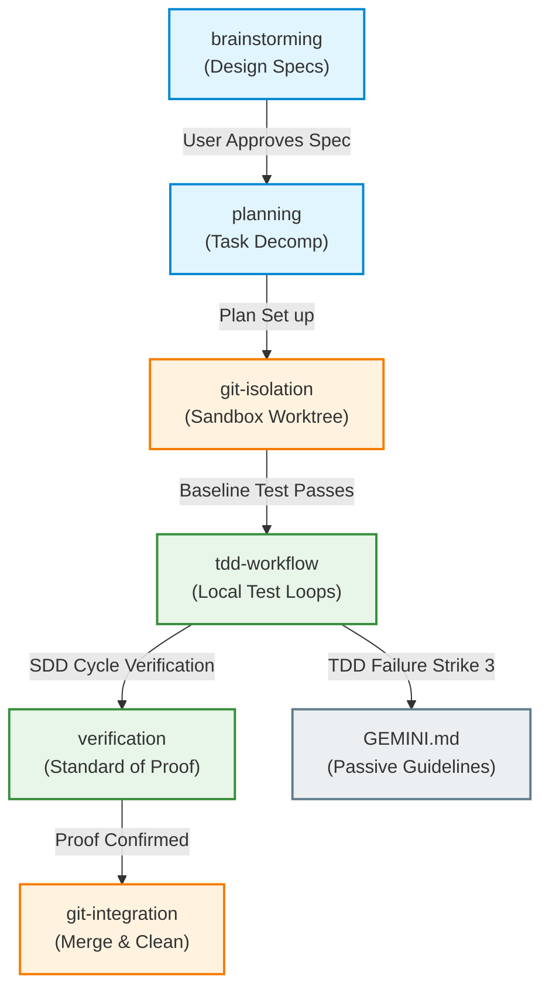

# AI Workspace Nexus (ai-workspace-nexus)

欢迎来到您的个人 AI 协同工作区与工作流配置枢纽。这是一个**专为主力 AI 编程助手 Antigravity 2.0 深度定制的全局原生配置库**。它集成了个人的开发技能（Skills）、生命周期钩子（Hooks）以及项目脚手架（Scaffold），旨在全方位沉淀您的软件工程规范、多媒体管理以及人机协作资产。

---

## 🎯 最终目标 (Ultimate Goal)

打造一个**“个人专属的 AI 辅助工作流引擎”**。当您与 Antigravity 2.0 协同工作时，该枢纽能够将您的**专业审美、工程/创作纪律、通用常识与工作流**无缝作为 native customizations 注入其运行上下文中，让其产出符合您个人高标准的工业级或专业级交付物。

---

## 🏛️ 原生配置映射关系 (Native Customizations Mapping)

本项目抛弃了非原生的 plugin 包装，直接对齐 Antigravity IDE 设置中 **Customizations** 面板的 4 类原生资源：

| 仓库目录/文件 | 全局部署目标路径 | 对应 IDE 菜单子项 | 核心作用说明 |
| :--- | :--- | :--- | :--- |
| **`GEMINI.md`** | `~/.gemini/GEMINI.md` | **Rules** | 存放被动触发的全局编码标准、调试铁律与反模拟测试规范。 |
| **`skills/`** | `~/.gemini/config/skills/` | **Skills** | 存放主动触发的步骤化开发技能（每一个必须包含 YAML 标头与 `SKILL.md`）。 |
| **`hooks.json` & `hooks/`** | `~/.gemini/config/hooks.json` & `/hooks/` | **Hooks** | 存放生命周期的 AOP 拦截门禁与计划注入机制。 |
| **`scaffold/`** | *（不部署，保留在仓库中）* | *（模板资产）* | 用于新建项目时，一键拷贝初始化项目本地的 `.agents/` 原生配置。 |

---

## 🗺️ 职责边界与协作流程 (Scope Separation & Boundaries)

为了防止 AI 智能体在执行任务时产生指令交叠、绕过或逻辑冲突，我们将核心规约划分了清晰的职责边界与顺承关系：



---

## 🛠️ 一键部署与同步命令 (One-Click Deployment)

本仓库提供了一个 PowerShell 脚本，可一键将本仓库的修改同步至您系统的全局配置目录中：

```powershell
# 运行部署脚本（自动拷贝 skills、GEMINI.md、hooks 至 ~/.gemini/ 对应路径中）
powershell -ExecutionPolicy Bypass -File .\deploy.ps1
```

运行后，重新加载 IDE 窗口即可在 **Customizations** 面板中看到全部更新。
