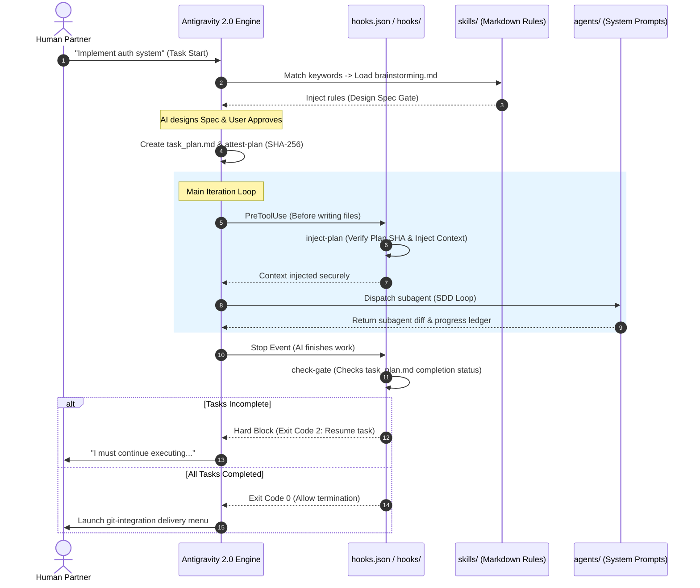

# Antigravity 2.0: Nexus Workflow & Integration Guide

This guide explains how the files in `ai-workspace-nexus` cooperate, how they hook natively into the **Antigravity 2.0** runtime engine, and how you can run your daily development workflow with this setup.

---

## 🏛️ System Architecture: How the Files Cooperate

The Antigravity 2.0 plugin architecture uses a declarative and event-driven design. The diagram below illustrates how a session lifecycle triggers different layers of the plugin:

### 1. The Configurations (Root Level)
* **`plugin.json`**: Tells the Antigravity Plugin Manager that this directory is an active plugin, declaring its name, version, and capabilities.
* **`mcp_config.json`**: Automatically registers standard Model Context Protocol (MCP) servers (Brave search, Local Filesystem, etc.) at startup, equipping the AI with secure tools.
* **`hooks.json`**: Binds scripts inside `hooks/` to the runtime event loops (`PreToolUse`, `Stop`, `PreInvocation`).

### 2. The Lifecycles (Hooks)
* **`hooks/inject-plan`**: Fired on `PreToolUse` (before every tool execution) and `PreInvocation`. It reads `task_plan.md` and `progress.md` on disk, calculates the SHA-256 hash of the plan, compares it to the attestation file, and injects the active phase context into the prompt. This keeps the AI focused and prevents context drift.
* **`hooks/check-gate`**: Fired on `Stop` (when the model tries to end the session). It acts as a termination oracle: if there are tasks in `task_plan.md` still marked as `[ ] pending` or `[/] in_progress`, it blocks the exit, prompting the model to complete the tasks first.
* **`hooks/run-hook.cmd`**: A Windows CMD/PowerShell wrapper allowing shell hook scripts to execute seamlessly across OS boundaries.

### 3. The Rules (Skills)
* **`skills/planning.md`**: Guides the AI on creating the "Triple-File Memory System" (`task_plan.md`, `findings.md`, `progress.md`) to survive context resets.
* **`skills/tdd-workflow.md`**: Enforces strict test-first development with the **Delete Punishment** (if code is written before tests, it must be deleted).
* **`skills/debugging.md`**: Enforces systematic root-cause tracing and the **3-Fixes Architecture Check** (re-plan instead of patching).
* **`skills/testing-anti-patterns.md`**: Gates the AI from asserting on mock behavior or polluting production code with test-only helpers.
* **`skills/condition-based-waiting.md`**: Forces the use of dynamic polling helpers rather than static delays (`sleep(50)`) to eliminate test flakiness.

---

## 🚀 End-to-End Daily Workflow Tutorial

Here is how you and Antigravity 2.0 work together on a feature:

### Step 1: Design Phase (Brainstorming Gate)
You prompt the AI with a high-level requirement:
> *"Let's build a notification queue system."*

* **What happens**: Antigravity automatically detects matching keywords and loads `skills/brainstorming.md`. The AI is forced to clarify requirements by asking **one question at a time**, draft a design spec (`.planning/design.md`), and wait for your explicit approval.

### Step 2: Planning & Attestation
Once you approve the spec, you tell the AI:
> *"Design looks good, generate the implementation plan."*

* **What happens**: The AI instantiates `templates/implementation_plan.md` to create `task_plan.md`, detailing files to modify, signatures consumed/produced, and precise TDD assertions.
* **Attestation Locking**: Once the plan is finalized, you or the AI run the attestation command to calculate the hash:
  `powershell -File hooks/run-hook.cmd attest-plan`
  This saves the hash to `.plan-attestation`, locking the plan.

### Step 3: Coding (Red-Green-Refactor)
The AI initializes a clean sandbox branch using `skills/git-isolation.md` and begins working.
* **What happens**: For each task, the AI writes the failing test first, compiles/runs it to watch it fail (RED), writes the minimum code to pass (GREEN), and refactors.
* **Hook Injection**: On every tool call (like editing code), `hooks/inject-plan` runs, verifies that the plan hash matches `.plan-attestation` (blocking if tampered), and injects:
  `===BEGIN-PLAN-DATA-<nonce>===` -> Current task status -> `===END-PLAN-DATA-<nonce>===`.

### Step 4: Verification & Gated Termination
Once the AI thinks it is done, it attempts to stop the session.
* **What happens**: The `Stop` event triggers `hooks/check-gate`.
  * **If any task is unfinished**: The gate blocks the exit and responds: *"Block reason: Phase X is still in_progress."* The AI is forced to continue executing.
  * **If all tasks are complete**: The gate returns `exit 0`, allowing the AI to present the **4-Option Git Delivery Menu** (merge branch, run staging test, keep open, or rollback).

---

## 📖 Global Settings & Best Practices

1. **Keep Mocks Clean**: When the AI writes tests, it must strictly follow `skills/testing-anti-patterns.md`. If you notice mock assertions creeping in, prompt: *"Verify this against the mock testing gates."*
2. **Never Hardcode Paths**: If you add new skills or templates, write paths relative to the project root (`./`) or use env variables.
3. **Re-Attest on Plan Adjustments**: If requirements change mid-task, update `task_plan.md`, then re-run the attestation lock script so the hooks accept the updated plan hash.
