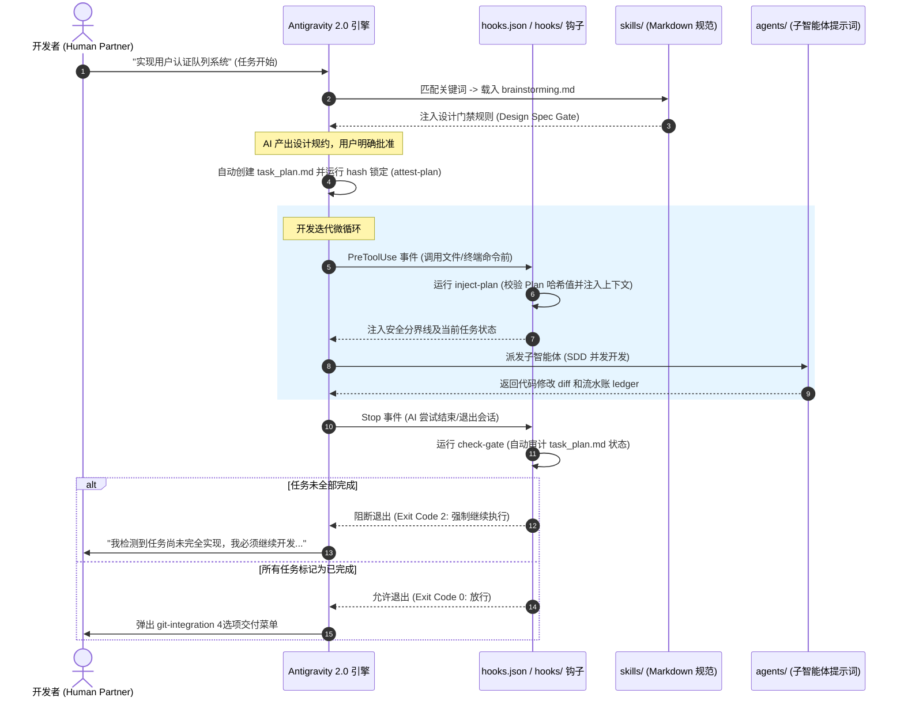

# Antigravity 2.0：Nexus 工作流与集成指南

本指南详细阐述了 `ai-workspace-nexus` 插件包中各个文件是如何协同工作的，它们是如何与 **Antigravity 2.0** 运行时引擎原生集成的，以及如何在日常开发中落地这一套高效、规范的人机协作工作流。

---

## 🏛️ 系统架构：文件如何协同运转

Antigravity 2.0 插件架构采用声明式与事件驱动的设计理念。下图直观地展示了在一次开发会话生命周期中，插件各组件是如何被依次触发的：

### 1. 根目录配置文件 (Configuration Layer)
* **`plugin.json`**：插件清单文件。向 Antigravity 声明此目录是一个可激活的本地/全局插件，定义其基本元数据。
* **`mcp_config.json`**：注册本地运行的 MCP 服务（如本地文件系统、Brave 搜索服务等），在会话启动时自动加载，赋予 AI 丰富的辅助工具。
* **`hooks.json`**：事件路由表。将 Antigravity 的生命周期事件（如 `PreToolUse`、`Stop`、`PreInvocation`）无缝绑定到 `hooks/` 目录下的自动化校验脚本。

### 2. 生命周期拦截钩子 (Lifecycle Hooks Layer)
* **`hooks/inject-plan`**：在 `PreToolUse`（模型调用任意工具前）和 `PreInvocation` 触发。它自动读取磁盘上的 `task_plan.md`，校验其哈希值是否与批准后的锁文件一致，并从 `progress.md` 提取最新进度，以安全 Nonce Delimiters 包装后注入上下文。防止模型在长周期开发中发生指令飘移或混淆。
* **`hooks/check-gate`**：在 `Stop`（模型尝试退出/完成会话前）触发。充当“终结判定阀”：若检测到 `task_plan.md` 中仍有 `[ ] pending` 或 `[/] in_progress` 的任务，它将阻断退出，发出未完结警告，迫使大模型继续执行，杜绝未测先交付的侥幸心理。
* **`hooks/run-hook.cmd`**：跨平台包装器。兼容 Windows PowerShell 和 CMD 环境，确保钩子脚本可在 Windows 和 Linux 下 100% 一致执行。

### 3. 通用开发规范 (Skills Layer)
* **`skills/planning.md`**：指导 AI 建立并维护磁盘上的“三文件记忆体”（`task_plan.md`、`findings.md`、`progress.md`），以保障在上下文 compaction（压缩）或重置后，AI 能 100% 恢复任务上下文。
* **`skills/tdd-workflow.md`**：确立 **TDD 铁律**与“删除惩罚机制”（写代码前必须先写 failing test，否则无条件就地删除代码重来）。
* **`skills/debugging.md`**：定义系统化根因分析方法（反向调用链追踪、多组件仪器化）与 **3-Fixes 架构质疑**（3次尝试失败后必须重新评估设计，而非机械地修补 bug）。
* **`skills/testing-anti-patterns.md`**：测试避坑指南。严禁对 Mock 进行断言、严禁在生产代码中注入测试专属接口、严禁局部 Mock。
* **`skills/condition-based-waiting.md`**：异步测试稳定器。强制以 polling（状态轮询）代替 arbitrary timeouts（如硬等待 `sleep(50)`），从根本上消除 CI 环境下的 flaky tests（测试抖动）。

---

## 🚀 每日研发工作流实操教程

在日常使用 Antigravity 2.0 时，您与 AI 的协作将按照以下标准研发周期推进：

### 第一步：脑暴与设计 Spec 审查 (Brainstorming Gate)
当您向 AI 提出一个高层需求时（例如：*"让我们做一个通知发送队列"*）：
* **机制运作**：插件会自动扫描关键字并载入 `skills/brainstorming.md`。
* **协作过程**：AI 会启动单问题提问机制（一次只问一个问题），逐步澄清边界，在 `.planning/design.md` 中输出设计规约（Spec），并等待您的显式批准。

### 第二步：规划拆解与哈希锁定 (Plan & Lock)
当您批准设计 Spec 后，对 AI 说：
> *"设计通过，请开始编写执行计划并分解任务。"*

* **机制运作**：AI 会读取 `templates/implementation_plan.md`，创建 `task_plan.md`，将任务拆解为可独立测试的细粒度阶段（Phase），列出入参/出参接口。
* **哈希锁定**：计划完成后，您或 AI 在终端运行哈希锁脚本：
  `powershell -File hooks/run-hook.cmd attest-plan`
  这会计算 `task_plan.md` 的 SHA-256 并写入 `.plan-attestation`，锁定计划内容。

### 第三步：分支隔离开发与 TDD 循环 (Execute)
AI 自动在隔离的 `git worktree` 沙箱分支上开展工作（遵循 `skills/git-isolation.md`）。
* **机制运作**：AI 针对每个子任务，先写测试用例（RED），运行看到其正确报错；然后编写最少量的代码使其通过（GREEN）；最后重构（REFACTOR）。
* **后台审计**：每次 AI 调用修改工具或运行命令，`PreToolUse` 钩子均在后台验证计划文件的哈希一致性，杜绝恶意代码注入或悄悄篡改已批准的设计。

### 第四步：门禁拦截与安全集成 (Gate & Delivery)
当 AI 声称全部开发完成，并尝试结束会话时：
* **机制运作**：`Stop` 生命周期事件触发 `hooks/check-gate`。
  * **如果尚有子阶段未完成**：门禁强行阻断退出，AI 被迫留下来继续编码。
  * **如果全部标记完成**：门禁放行，AI 自动根据 `skills/git-integration.md` 调出 **4选项交付菜单**（1. 自动合并主干；2. 保留 Staging 分支供人工审计；3. 挂起分支；4. 安全回滚清理）。

---

## 💡 全局最佳实践建议

1. **测试防空转**：如果发现 AI 编写的测试只有对 mock 方法的 trace 调用，直接输入：“*请对照 testing-anti-patterns.md 检查你的测试隔离门禁。*”
2. **零路径依赖**：如果您在项目中新建了特定语言的开发规范，请使用相对路径引用，确保 100% 的即插即用移植性。
3. **重新 attest 机制**：若在开发中途必须调整任务步骤，请修改 `task_plan.md` 后，务必在终端执行 `attest-plan` 重新锁死哈希，否则生命周期钩子在执行后续工具时会因校验不一致而报警拦截。
