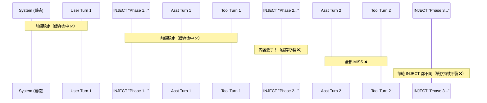

# Cache-Safe Mode 图解

## 核心问题

DeepSeek 缓存的命中性依赖于 **前缀完全一致**。如果注入的消息内容在每轮不同，则该点之后的前缀都会变，缓存就会从注入点开始断裂。

---

## Turn 1 → Turn 2 → Turn 3 对比

### parity 模式（动态注入 plan 正文）

```
Turn 1:  [SYS, USER_1, INJECT("Phase1: Setup..."), A1, TOOL1, ...]
                     ^^^^^^  内容1: "Phase 1"
Turn 2:  [SYS, USER_1, INJECT("Phase1: Setup..."), A1, TOOL1, ..., 
           INJECT("Phase2: Build..."), A2, TOOL2, ...]
           ^^^^^^  内容2: "Phase 2"  ← 这里变了！

【缓存命中状态】
  Turn 1 → Turn 2:
    SYS                           → 命中 ✅（从未变过）
    USER_1 + INJECT("Phase1")     → 命中 ✅（与 Turn 1 尾部匹配）
    A1 + TOOL1 + ... + INJECT("Phase2") 
                                  → 断裂 ❌（INJECT 内容不同于 Phase1）
    从此之后全部 MISS ❌❌❌
```

### cache-safe 模式（固定常量提醒）

```
Turn 1:  [SYS, USER_1, REMINDER, A1, TOOL1, ...]
                     ^^^^^^^^  固定: "Read task_plan.md..."
Turn 2:  [SYS, USER_1, REMINDER, A1, TOOL1, ..., 
           REMINDER, A2, TOOL2, ...]
           ^^^^^^^^  依然是完全相同的字符串！

【缓存命中状态】
  Turn 1 → Turn 2:
    SYS                           → 命中 ✅
    USER_1 + REMINDER             → 命中 ✅（与 Turn 1 尾部匹配）
    A1 + TOOL1 + ... + REMINDER   → 命中 ✅（内容与 Turn 1 完全一致）
    A2 + TOOL2 + ...              → 断裂 ❌（新内容没有缓存过）
  
  但注意：第 2 轮前半段（直到第 2 个 REMINDER）全部命中缓存，
  只有最后的新内容（A2, TOOL2...）才是 MISS。
  相比 parity 模式，多命中了巨大的一段前缀。
```

---

## 消息数组视角

### parity：动态注入→ 每次 INJECT 不同 → 前缀断裂



### cache-safe：恒定 REMINDER → 前缀稳定 → 缓存延续

```mermaid
sequenceDiagram
    participant SYS as System (静态)
    participant U1 as User Turn 1
    participant R1 as REMINDER "Read task_plan.md..."
    participant A1 as Asst Turn 1
    participant T1 as Tool Turn 1
    participant R2 as REMINDER "Read task_plan.md..."
    participant A2 as Asst Turn 2
    participant T2 as Tool Turn 2
    participant R3 as REMINDER "Read task_plan.md..."
    participant A3 as Asst Turn 3

    Note over SYS,R1: 前缀稳定（缓存命中 ✅）
    Note over A1,T1,R2: REMINDER 内容不变！（缓存延续 ✅）
    Note over A2,T2,R3: REMINDER 仍不变！（缓存延续 ✅）
    Note over A3: 仅新助手内容 MISS（极小代价）
```

---

## 本质对比

```
parity 模式： [SYS, U, "Phase1...", A1, "Phase2...", A2, "Phase3...", A3]
                                      ^^^^^^          ^^^^^^
                                      每轮不同 → 从前缀断裂起全 MISS

cache-safe：  [SYS, U, REMINDER, A1, REMINDER, A2, REMINDER, A3]
                         ^^^^^^^^   ^^^^^^^^   ^^^^^^^^
                         完全相同 → 前缀延续 → 大量命中

命中差异：  parity 每轮只命中最前面 2 条消息
            cache-safe 每轮可命中前面 4-5 条消息（巨大的 token 量差异）
```

---

## 代码层面的实现

### parity 模式注入的内容（每轮不同）：

```typescript
// runtime.ts - buildParityPlanInjection()
// 内容包含计划正文、进度的实际数据
// 随着 plan phase 更新，内容变化
"[planning-with-files] ACTIVE PLAN — current state:
===BEGIN PLAN DATA===
# Task Plan: Backend Refactor

...

Phase 1: Setup  (complete)
Phase 2: Core   (in_progress)
===END PLAN DATA===
=== recent progress ===
..."
```

### cache-safe 模式注入的内容（恒定的常量）：

```typescript
// constants.ts - CACHE_SAFE_REMINDER
// 永远不变的固定字符串
"[planning-with-files] Read task_plan.md for current phase and status. " +
"Read findings.md for research context. Read progress.md for recent changes. " +
"Continue from the current phase.";
```

由于 `CACHE_SAFE_REMINDER` 每次完全相同，它构成了 DeepSeek **缓存前缀单元**的一部分，后续请求的前缀可以完美匹配之前的请求。

真实的计划内容 `task_plan.md` / `progress.md` / `findings.md` 由 agent 主动调用 `read` 工具读取——这是 **文件系统访问路径**，不是消息前缀的一部分，因此不影响缓存。

---

## 额外优势

在 cache-safe 模式中，**`before_agent_start` 注入** + **`tool_call` 注入** 使用的都是同一组固定常量：

- `CACHE_SAFE_REMINDER`（用户发言后）
- `PRE_TOOL_CACHE_SAFE_REMINDER`（工具调用前）

这两个字符串在消息序列中的每一轮出现位置固定、内容固定。DeepSeek 的 **公共前缀检测落盘机制** 在多次请求后会自动将这些固定段合并为独立的缓存单元，进一步缩小 MISS 区域。
